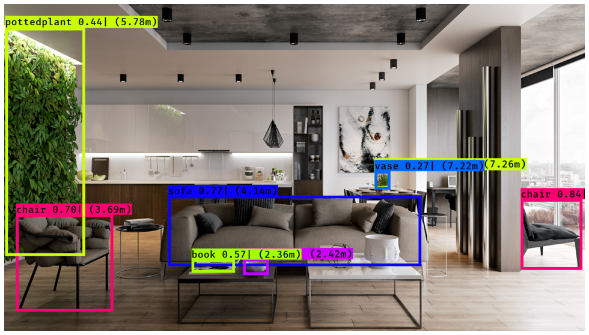
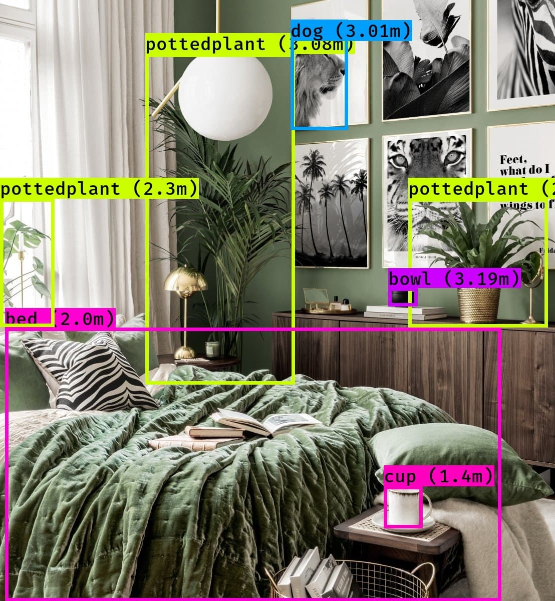
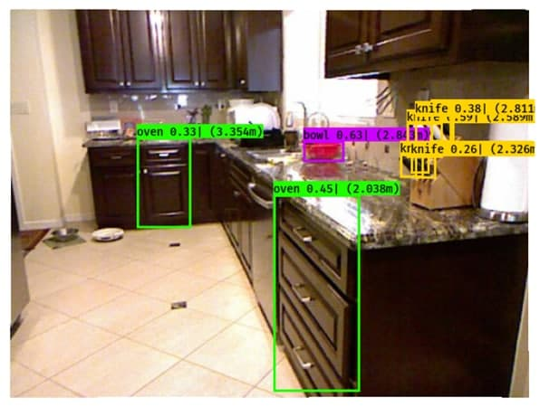
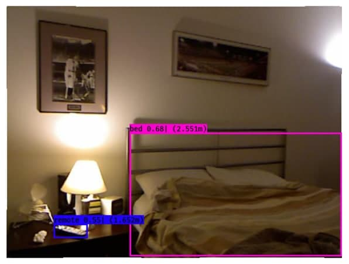
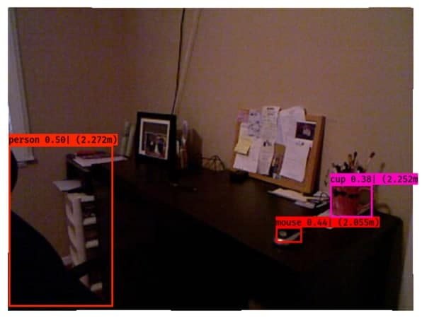
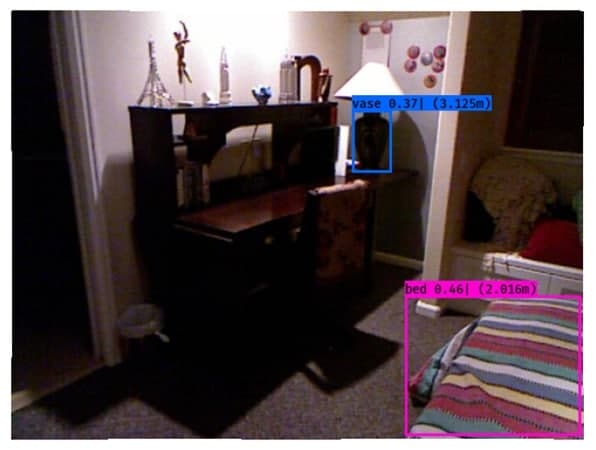

# joint_object_detection_depth_estimation
## Deep Learning Final Project 
### Created by: Zahra Meskar (SID: 99206406), Mohsen Shirkarami (SID: 99206366)

In this project we combined two neural networks to perform object recognition and depths estimation tasks simultaneously.

Official repository:            (https://github.com/Nadiam75/joint_object_detection_depth_estimation)

Pretrained Depth Estimation:    (https://github.innominds.com/karoly-hars/DE_resnet_unet_hyb)

Pretrained Yolo_V5:             (https://github.com/ultralytics/yolov5)

Pretrained Yolo_V2:             (https://pjreddie.com/darknet/yolov2)

Dataset Used to Train the Network (https://cs.nyu.edu/~silberman/datasets/nyu_depth_v2.html




## Usage

### 1) Requirements

- Python
- Pytorch
- Opencv-Python
- Matplotlib
- h5py
- PIL
- scipy
- tensorflow
- torchvision


### 2) Folders & Files


  DL_Project.ipynb      
  
  joint object detection and depth estimation using pretrained YOLO_V5 and Pretrained Depth Estimation 
  
  DL_YOLOv2_ResnetUnetHybrid.ipynb     
  
  joint object detection and depth estimation using pretrained YOLO_V2  and Pretrained Depth Estimation
  
  trained_depth_yolo_v5        
  
  joint object detection and depth estimation using pretrained YOLO_V2  and trainin Depth Estimation on NYU dataset
  
  

### 3) Telegram Bot

Telgeram bot available at: @DL_Sharif_Project_bot


### 4) Web application

In order to install the dependencies run the following commands in shell

``` shell
Pip install -r requirements.txt
```

To Start the Server Run the following command:
``` shell
Python manage.py runserver
```

### 3) Visualize result


Here are some of our training results on TEST DATASET (depth estimation model has been trained for 30 epochs on NYU):

<!-- // 
 -->

<!-- 


 -->







## Contact

Email: nadia.meskar@yahoo.com, m.shirkarami@gmail.com

Welcome for any discussions! 

